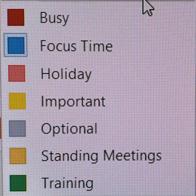
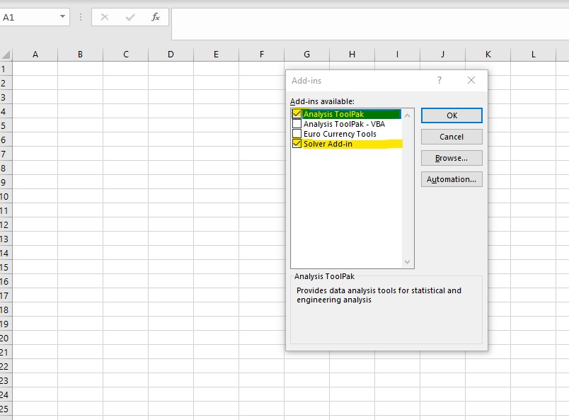

# My Mobile Office Equipment

- Kelvin D. Meeks
  + kmeeks@intltechventures.com
  + https://www.linkedin.com/in/kelvinmeeks/
  + http://www.intltechventures.com

## Hardware

### Computers 

- __Current Primary Laptop__ (for research & development): *May 2023*
  + HP Envy 17-cr0xxx, 64GB RAM, 2TB SSD, 12th Gen Intel(R) Core(TM) i7-1260P, 12-Core, 2.10 GHz, 2 Thunderbolt 4, WiFi 6E, BT 5.3, Windows 11 Pro
  + https://www.amazon.com/gp/product/B0BGKKF2DD/

- __Previous Primary Laptop__: *April 2016, DIED January 2024*
  + MSI GT72 6QE, Intel® Core™ i7-6700HQ, 24GB RAM (DDR4 2133MHz), two SSD drvies (1TB M.2 SATA SSD, 1TB SATA SSD), 8.4 lbs, Windows 10 Pro
  + Fry's Electronics purchase

- __Secondary Laptop__ (for client work): *May 2024*
  + MSI Raider GE76 12UE, Gaming Laptop, Intel Core i7-12700H (12th Gen, 14 core CPU, 2.69-4.7GHz), 64GB RAM (4800MHz, DDR5), 2TB NVMe SSD HDD, 17.3" FHD 144 Hz, NVIDIA GeForce RTX 3060, 802.11ax WiFi, Battery Pack - 4 cell (99.9Whr), Windows 11, 6.39 pounds 
  + https://www.amazon.com/dp/B0BTHLR9RR

- __Emergency Backup Laptop__: *January 2017*
  + Lenovo Ideapad 80TJ 110-15ACL, AMD A8-7410 2.2Ghz, 8GB RAM (1,600 MHz), 1TB SATA SSD, 4.8 lbs, Windows 10 Pro
  + Fry's Electronics purchase


### Peripherals 

- [Logitech K540 keyboard](https://www.amazon.com/Logitech-Wireless-Keyboard-Computers-Laptops/dp/B07QY3BJBV) [2024 model](https://www.amazon.com/Logitech-Advanced-Wireless-USB-Receiver-Multimedia/dp/B0CBPNWCVS/)
  + Future, to evaluate:
    * [K380 Multi-Device Bluetooth Keyboard](https://www.logitech.com/en-us/product/multi-device-keyboard-k380)
    * [K780 K780 Multi-Device Wireless Keyboard](https://www.logitech.com/en-us/product/k780-multi-device-wireless-keyboard?crid=27)
      * switch between (3) different devices...

- [Logitech M310 mouse](https://www.amazon.com/Logitech-M310-Wireless-Mouse-Symmetrical/dp/B008QS8G5O/)
  +(This mouse came bundled with the K540 keyboard)
  + Future, to evaluate:
    * [M720 Triathlon, Multi-device wireless mouse](https://www.logitech.com/en-us/product/m720-triathlon?crid=7)

- [ULBRE Soho KVM Switch 4 Port USB 3.0 Sharing Box Selector, 4Port Peripheral Switcher KM Adapter KVM Console Hub for Office PC Printer Mouse Keyboard](https://www.amazon.com/dp/B07DKD7JHG/) 

- [HDMI Switch 4K@60hz HDMI Splitter, Aluminum HDMI 2.0 Switcher 2 in 1 Out, HDMI Splitter 1 in 2 Out, Bi-Directional Switch Support 4K 3D HDR for Xbox PS5/4/3 Blu-Ray Player Fire Stick Roku HDTV](https://www.amazon.com/gp/product/B09D7MRPJF/)

- Logitech H390 USB Headset w/Noise-Canceling Microphone
  + https://www.walmart.com/ip/Logitech-H390-USB-Headset-w-Noise-Canceling-Microphone/8198023
  + https://www.amazon.com/Logitech-logitech-noisecanceling-Microphone-Packaging/dp/B075G4JT4S/


### Networking

- WiFi Extender
  + [TP-Link AC2600 WiFi, Extender(RE650), Up to 2600Mbps, Dual Band WiFi Range Extender, Gigabit port, Internet Booster, Repeater, Access Point,4x4 MU-MIMO](https://www.amazon.com/Extender-2600Mbps-Repeater-Internet-RE650/dp/B01MR90E3A/)

- Mobile Hotspot Wifi
  + Primary: [T-Mobile MiFi, Inseego, 5G MiFi M2000](https://www.t-mobile.com/hotspot-iot-connected-devices/inseego-5g-mifi-m2000)
  + Secondary: NETGEAR AirCard AC781S AT&T Unite Pro 4g LTE Hotspot


- FUTURE PLANNED ADDITIONS:
  + [GL-AXT1800 (Slate AX) Pocket-sized Wi-Fi 6 Gigabit Travel Router](https://www.amazon.com/GL-iNet-GL-AXT1800-Pocket-Sized-Extender-Repeater/dp/B0B2J7WSDK)
    * re: Dave's Garage YouTube Episode: [Why You Need a Pocket Router: Hotels, Airports, Airplanes, Cruise Ships - Stay Connected Anywhere!](https://www.youtube.com/watch?v=OYxQ4Lvqn14)


### Printers

- Printer
  + [HP LaserJet Pro MFP M29w](https://www.amazon.com/HP-Laserjet-M29W-Wireless-Monochrome/dp/B09MTFNC5P/)
    * All-in-One Wireless Monochrome Laser Printer for Home Business Office, White - Print Scan Copy - 19 ppm, 600 x 600 dpi, 8.5 x 11.69 Print Size, 1.0" Icon LCD Display 


### Monitors 

- Monitor
  + [HP M24f FHD (model 2D9K0AA)](https://www.amazon.com/New-HP-M24f-Monitor-Anti-Glare/dp/B09HW5QGVR/)
    * 23.8" FHD 1080p IPS LED Anti-Glare Monitor, Silver and Black - AMD FreeSync, 70Hz, 300 nits, HDMI & VGA Ports, Tilt + HDMI Cable 

  
  

__These following sections are the primary software programs that I typically have installed on my personal development machine...__


## Application Package Managers (still evaluating...)

- winget
  + https://github.com/microsoft/winget-cli
    * https://github.com/microsoft/winget-pkgs
      * https://github.com/microsoft/winget-pkgs/tree/master/manifests
  + https://devblogs.microsoft.com/commandline/windows-package-manager-preview/

- https://chocolatey.org/

- https://sdkman.io/


## Security Tools

- Anti-Virus / Firewall
  + Microsoft Defender

  + Alternatives:
    * [Norton Security](http://us.norton.com/)

  + 2019 Product Reviews:
    * https://www.pcmag.com/article2/0,2817,2372364,00.asp
    * https://www.av-test.org/en/antivirus/home-windows/
    * https://www.techradar.com/best/best-antivirus
    * https://www.pcworld.com/article/3219792/computers/best-antivirus-for-windows-pc.html
    * https://www.tomsguide.com/us/best-windows-antivirus,review-6044.html

- [MalwareBytes](https://www.malwarebytes.org/)

- [TrueCrypt](http://truecrypt.sourceforge.net/)
  + NOTE: 
    * The developers posted this warning on the web site: 
      * ```WARNING: Using TrueCrypt is not secure as it may contain unfixed security issues```
      * ```WARNING: Using TrueCrypt is not secure```
    * "The development of TrueCrypt was ended in 5/2014 after Microsoft terminated support of Windows XP. Windows 8/7/Vista and later offer integrated support for encrypted disks and virtual disk images."
  + https://en.wikipedia.org/wiki/TrueCrypt
    * "On 28 May 2014, the TrueCrypt official website, truecrypt.org, began redirecting visitors to truecrypt.sourceforge.net with a HTTP 301 "Moved Permanently" status"
    * "On 28 May 2014, the TrueCrypt website announced that the project was no longer maintained and recommended users find alternative solutions. Though development of TrueCrypt has ceased, an independent audit of TrueCrypt (published in March 2015) has concluded that no significant flaws are present"
    * "Shortly after the end of life announcement of TrueCrypt, Gibson Research Corporation posted an announcement titled "Yes... TrueCrypt is still safe to use" and a Final Release Repository to host the last official non-crippled version 7.1 of TrueCrypt"
    * "TrueCrypt is vulnerable to various known attacks which are also present in other software-based disk encryption software such as BitLocker. To prevent those, the documentation distributed with TrueCrypt requires users to follow various security precautions" - [Some of those attacks are detailed in the Wikipedia article]
  + Possible Alternatives:
    * https://www.veracrypt.fr/en/Home.html


- [GnuPG](https://www.gnupg.org/)
- Curated sources for inclusion in hosts file
  + https://github.com/StevenBlack/hosts
    * Update Windows file: ```%SystemRoot%\system32\drivers\etc\hosts```


- A good security scanning utility (above your regular firewall and anti-virus) - that you must download and run manually. 
  + Note: "Safety Scanner only scans when manually triggered and is ```available for use 10 days after being downloaded.``` We recommend that you always download the latest version of this tool before each scan."
  + https://docs.microsoft.com/en-us/microsoft-365/security/intelligence/safety-scanner-download?view=o365-worldwide


- hosts file
  + Location:
    * ``` C:\Windows\System32\drivers\etc\hosts```
    * ```%SystemRoot%\system32\drivers\etc\hosts``` 
  + Documentation:
    * https://learn.microsoft.com/en-us/windows/powertoys/hosts-file-editor
    * https://support.microsoft.com/en-us/topic/how-to-reset-the-hosts-file-back-to-the-default-c2a43f9d-e176-c6f3-e4ef-3500277a6dae
    * https://support.microsoft.com/en-us/topic/microsoft-tcp-ip-host-name-resolution-order-dae00cc9-7e9c-c0cc-8360-477b99cb978a
    * https://www.howtogeek.com/784196/how-to-edit-the-hosts-file-on-windows-10-or-11/
    * https://lifehacker.com/how-to-really-block-distracting-websites-with-your-ho-1831493194
    * https://nordvpn.com/blog/use-hosts-file-block-ads-malware/
    * https://en.wikipedia.org/wiki/Hosts_(file)

  + Useful Lists
    * https://github.com/StevenBlack/hosts/
      * https://github.com/StevenBlack/hosts/tree/master/data/add.Risk

  + Personal List
    * ```# Kelivn - Personal list```
    * ```127.0.0.1 video.dailymail.co.uk					# block Daily Mail pop-up videos```
  


## The Essentials...

### Web Browsers

- [Chrome](https://www.google.com/intl/en/chrome/browser/thankyou.html?platform=win64)
  + Plugins
    * [Postman](https://chrome.google.com/webstore/detail/postman/fhbjgbiflinjbdggehcddcbncdddomop?hl=en)
	  * Or, download stand-alone app:
	  * https://www.postman.com/
    * [Vue.js devtools](https://chrome.google.com/webstore/detail/vuejs-devtools/nhdogjmejiglipccpnnnanhbledajbpd)
    * https://www.tampermonkey.net/
      * https://chrome.google.com/webstore/detail/tampermonkey/dhdgffkkebhmkfjojejmpbldmpobfkfo
  + Chrome Configuration Modifications
    + Disable Media Volume Control Pop-up
      * https://www.howtogeek.com/426284/how-to-stop-chrome-or-edge-from-taking-over-your-media-keys/
      * https://winaero.com/how-to-dismiss-windows-10-media-volume-control-pop-up/
      * ```chrome://flags/#hardware-media-key-handling```
    + Show memory usage in hover
      * ```chrome://flags/#memory-saver-memory-usage-in-hovercards```


- [Firefox](https://www.mozilla.org/firefox)
  + Plugins
    * https://www.greasespot.net/
      * https://addons.mozilla.org/en-US/firefox/addon/greasemonkey/
  + Firefox Configuration Modification
    + Disable Media Volume Control Pop-up
      * https://winaero.com/enable-or-disable-media-controls-in-mozilla-firefox/
      * https://support.mozilla.org/en-US/questions/1301997
        * ```media.hardwaremediakeys.enabled=false```
  + show memory usage:
    + enter ```about:memory``` in URL bar


### Email Client

- [Thunderbird](https://www.mozilla.org/en-US/thunderbird/)
  + Plugins:
    * https://addons.thunderbird.net/en-US/thunderbird/addon/calendar-tweaks/
	* https://addons.thunderbird.net/en-US/thunderbird/addon/provider-for-google-calendar/?src=hp-dl-mostpopular
	* https://www.maketecheasier.com/12-thunderbird-addons-you-shouldnt-be-without/
  + Config Editor Changes:
    * ```mail.identity.default.suppress_signature_separator``` - change to ```true```
      * http://kb.mozillazine.org/Signatures_(Thunderbird)#Removing_the_signature_separator
      * https://support.mozilla.org/en-US/questions/1019583

- Calendar Colors
  + 


### eBook Readers

- https://en.wikipedia.org/wiki/List_of_PDF_software

- Sumatra PDF
  + https://en.wikipedia.org/wiki/Sumatra_PDF
  + https://www.sumatrapdfreader.org/free-pdf-reader
  + https://github.com/sumatrapdfreader/sumatrapdf


- DISCARDED - [Adobe Reader](https://get.adobe.com/reader/)
  + Fonts: (needed to print certain documents, e.g. WA Healthcare 1095-A)
    * [Adobe Acrobat Reader DC Font Pack (Continuous) - For Acrobat Reader DC version 19.x](https://supportdownloads.adobe.com/thankyou.jsp?ftpID=6484&fileID=6484)

- Kindle 
  + https://www.amazon.com/kindle-dbs/fd/kcp

- Calibre
  + https://calibre-ebook.com/
  + https://en.wikipedia.org/wiki/Calibre_(software)


### Basic Code/Text/Config Editors
- [Notepad++](https://notepad-plus-plus.org/)
  + Additional Plugins
    * DSpellCheck
    * Markdown++
      * https://github.com/Edditoria/markdown-plus-plus 
    * NppRegExTractor
      * https://github.com/viper3400/NppRegExTractor
    * HEX-Editor
    * JSLint
    * JSON Viewer
    * JSTool
    * Mime Tools
    * Npp Converter
    * NppExec
    * NppExport
    * PyNPP
    * RunMe
    * Tidy2
  + User-contributed User-Defined Languages (UDLs):
    * https://github.com/notepad-plus-plus/userDefinedLanguages
    * TOML  
      * https://github.com/notepad-plus-plus/userDefinedLanguages/blob/master/UDLs/TSL_byTorkelLindahl.xml
      * https://raw.githubusercontent.com/notepad-plus-plus/userDefinedLanguages/master/UDLs/TOML_byTimendum.xml


- [Visual Studio Code](https://code.visualstudio.com/)
  + https://code.visualstudio.com/docs/

  + [Marketplace for Extensions](https://code.visualstudio.com/docs?start=true#top-extensions)

  + My Installed Extensions:
    * https://marketplace.visualstudio.com/itemdetails?itemName=dbaeumer.vscode-eslint 

    * https://marketplace.visualstudio.com/items?itemName=Tyriar.vscode-terminal-here
      * "Creates an intergrated terminal session at the current file's directory"
        * ```ctrl/cmd+shift+p```
        * View > Command Palette > ``` terminalHere.create```
      * https://github.com/Tyriar/vscode-terminal-here
      * https://marketplace.visualstudio.com/items?itemName=mgmcdermott.vscode-language-babel

    * https://marketplace.visualstudio.com/items?itemName=YoshinoriN.current-file-path

    * Go Tools
      * gocode
      * gopkgs
      * go-outline
      * go-symbols
      * guru
      * gorename
      * dlv
      * gocode-gomod
      * godef
      * goreturns
      * golint

    * Scala Plugins
      * https://marketplace.visualstudio.com/items?itemName=scala-lang.scala
        * https://github.com/scala/vscode-scala-syntax

    * Remote Development (Preview)
      * https://marketplace.visualstudio.com/items?itemName=ms-vscode-remote.vscode-remote-extensionpack

  + Other Extensions to consider:
    * HashiCorp Terraform
      * https://marketplace.visualstudio.com/items?itemName=HashiCorp.terraform

    * The Postman VS Code extension
      * https://marketplace.visualstudio.com/items?itemName=Postman.postman-for-vscode
      

- Alternatives:
  * [ATOM](https://atom.io/) - (still evaluating...)
    * https://github.com/atom/atom

- For Future Consideration: Online Editors
  + https://codeanywhere.com/


### Utilities

- [Cygwin](https://www.cygwin.com/)

- [Microsoft Sysinternals Suite](https://docs.microsoft.com/en-us/sysinternals/downloads/sysinternals-suite)

- [TeraCopy](https://codesector.com/teracopy)


### File Diff Utilities

- [KDiff3](https://sourceforge.net/projects/kdiff3/files/kdiff3/)

- Possible Alternatives
  * https://en.wikipedia.org/wiki/Comparison_of_file_comparison_tools
  * http://www.scootersoftware.com
  * https://www.devart.com/codecompare/
  * http://winmerge.org/
  * https://sourceforge.net/projects/winmerge/
  * http://meldmerge.org/
    * https://gitlab.gnome.org/GNOME/meld


## Diagramming & Design Tools

- [Sparx Enterprise Architect](http://www.sparxsystems.com/)

- Open Source Alternatives:

  + [Umlet](https://www.umlet.com/)
    * https://www.umlet.com/changes.htm 
    * https://github.com/umlet/umlet
    * https://marketplace.visualstudio.com/items?itemName=TheUMLetTeam.umlet
    * Online version
      * http://www.umletino.com/

  * [Archi](https://www.archimatetool.com/)


## IDE Tools for Software Developemnt

- [Microsoft Visual Studio](https://www.visualstudio.com/)
  + https://visualstudio.microsoft.com/downloads/

  + Marketplace: Visual Studio > tools 
    * https://marketplace.visualstudio.com/search?target=VS&category=Tools&vsVersion=&subCategory=All&sortBy=Installs

  + Configuration Options:
    * Setting the MSBuildDebugEngine=1 environment variable and then starting VS will give you full, proper binlogs from Visual Studio builds (including design-time)
      * https://github.com/dotnet/msbuild/blob/e868d91a40fb59cd258844a8d31114c1c3fabf2a/documentation/wiki/Building-Testing-and-Debugging-on-Full-Framework-MSBuild.md#logs

  + Marketplace Extensions:
    * https://marketplace.visualstudio.com/items?itemName=YoshinoriN.current-file-path
    * Markdown Editor
       * https://marketplace.visualstudio.com/items?itemName=MadsKristensen.MarkdownEditor
       * https://github.com/madskristensen/MarkdownEditor
    * GitHub Extension for Visual Studio
      * https://marketplace.visualstudio.com/items?itemName=GitHub.GitHubExtensionforVisualStudio
      * https://visualstudio.github.com/


- [Visual Studio Code](https://code.visualstudio.com/)
  + Disable these configuration settings
    * ```telemetry.enableTelemetry```

  + Suggested: Disable Program Data Package Cache
    * https://www.quora.com/Can-I-delete-the-folder-C-ProgramData-Package-Cache
      * Disable: ```"%ProgramFiles(x86)%\Microsoft Visual Studio\Installer\vs_installer.exe" --nocache```
      * Enable: ```"%ProgramFiles(x86)%\Microsoft Visual Studio\Installer\vs_installer.exe" repair --passive --norestart --cache```

  + Marketplace Extensions:
    * https://marketplace.visualstudio.com/items?itemName=ms-dotnettools.csdevkit
      * C# Dev Kit for Visual Studio Code (Official C# extension from Microsoft)
      * https://learn.microsoft.com/en-us/visualstudio/subscriptions/vs-c-sharp-dev-kit
      * https://code.visualstudio.com/docs/csharp/cs-dev-kit-faq


    * https://marketplace.visualstudio.com/items?itemName=confluentinc.vscode-confluent
      * Confluent for VS Code
      * Work with Confluent and Apache Kafka® to design, build and run data streaming applications.
      * https://docs.confluent.io/cloud/current/client-apps/vs-code-extension.html
      * https://github.com/confluentinc/vscode
      * https://github.com/confluentinc/vscode/releases

    * https://marketplace.visualstudio.com/items?itemName=rust-lang.rust-analyzer
      * rust-analyzer
      * This extension provides support for the Rust programming language. It is recommended over and replaces rust-lang.rust.

    * https://marketplace.visualstudio.com/items?itemName=golang.go
      * Go for Visual Studio Code

    * https://marketplace.visualstudio.com/items?itemName=YoshinoriN.current-file-path
      * display current file's path from absolute (root directory) or workspace highest directory in StatusBar by Unix style or Windows style.

    * https://marketplace.visualstudio.com/items?itemName=HookyQR.beautify
      * js-beautify for VS Code

    * https://marketplace.visualstudio.com/items?itemName=ms-mssql.mssql
      * mssql for Visual Studio Code
      * https://sqlchoice.azurewebsites.net/en-us/sql-server/developer-get-started/csharp/win/step/2.html
      * https://docs.microsoft.com/en-us/sql/linux/sql-server-linux-develop-use-vscode?view=sql-server-2017

    * https://marketplace.visualstudio.com/items?itemName=octref.vetur
      * Vue tooling for VS Code

    * https://marketplace.visualstudio.com/items?itemName=ms-vscode.cpptools
      * C/C++ IntelliSense, debugging, and code browsing.

    * https://marketplace.visualstudio.com/items?itemName=Dart-Code.dart-code
      * Dart language support and debugger for Visual Studio Code.

    * https://marketplace.visualstudio.com/items?itemName=PeterJausovec.vscode-docker
      * Adds syntax highlighting, commands, hover tips, and linting for Dockerfile and docker-compose files.

    * https://marketplace.visualstudio.com/items?itemName=dbaeumer.vscode-eslint
      * Integrates ESLint into VS Code

    * https://marketplace.visualstudio.com/items?itemName=ms-vscode.Go
      * This extension adds rich language support for the Go language to VS Code.

    * https://marketplace.visualstudio.com/items?itemName=redhat.java
      * Language support for Java ™ for Visual Studio Code

    * https://marketplace.visualstudio.com/items?itemName=PKief.material-icon-theme
      * The Material Icon Theme provides lots of icons based on Material Design for Visual Studio Code.

    * https://marketplace.visualstudio.com/items?itemName=ms-vscode.PowerShell
      * This extension provides rich PowerShell language support for Visual Studio Code. 

    * https://marketplace.visualstudio.com/items?itemName=ms-python.python
      * A Visual Studio Code extension with rich support for the Python language (for all actively supported versions of the language: 2.7, >=3.5), including features such as IntelliSense, linting, debugging, code navigation, code formatting, Jupyter notebook support, refactoring, variable explorer, test explorer, snippets, and more!

    * https://marketplace.visualstudio.com/items?itemName=humao.rest-client
      * REST Client allows you to send HTTP request and view the response in Visual Studio Code directly.

    * https://marketplace.visualstudio.com/items?itemName=asciidoctor.asciidoctor-vscode
      * AsciiDoc support for Visual Studio Code
      * https://github.com/asciidoctor/asciidoctor-vscode

    * https://marketplace.visualstudio.com/items?itemName=TheUMLetTeam.umlet
      * Free UML Tool for Fast UML Diagrams

    * https://www.julia-vscode.org/
      * This VS Code extension provides support for the Julia programming language.

    * https://marketplace.visualstudio.com/items?itemName=ms-dotnettools.csdevkit
      * C# Dev Kit

    * https://marketplace.visualstudio.com/items?itemName=ms-vscode-remote.remote-wsl
      * Visual Studio Code WSL
      * https://code.visualstudio.com/docs/remote/wsl
      * https://learn.microsoft.com/en-us/windows/wsl/


    * https://marketplace.visualstudio.com/items?itemName=ms-vscode-remote.remote-containers
      * Visual Studio Code Dev Containers
      * Open any folder or repository inside a Docker container and take advantage of Visual Studio Code's full feature set.

    * https://marketplace.visualstudio.com/items?itemName=ms-vscode-remote.vscode-remote-extensionpack
      * Visual Studio Code Remote Development Extension Pack
      * https://github.com/Microsoft/vscode-remote-release


    * ```TODO: Research other VS Plugins/Extensions:```
      * Source ideas: 
        * https://twitter.com/laurieontech/status/1582738189948633095

      * Better Haml      

      * [Copy GitHub URL](https://marketplace.visualstudio.com/items?itemName=mattlott.copy-github-url)

      * https://marketplace.visualstudio.com/items?itemName=ms-vscode-remote.remote-containers
        * Dev Containers
        * Open any folder or repository inside a Docker container and take advantage of Visual Studio Code's full feature set.

      * Docker

      * Endwise

      * ESLint

      * Excel to Markdown Table
        * https://marketplace.visualstudio.com/items?itemName=csholmq.excel-to-markdown-table

      * Git Graph

      * GitHub PR 

      * GitLab Workflow

      * [GitLens](https://marketplace.visualstudio.com/items?itemName=eamodio.gitlens)

      * HAML Lint

      * Jira and Bitbucket

      * Jupyter

      * PlantUML

      * Peacock

      * Prettier

      * Rainbow CSV
      * Rainbow Indent

      * Sourcegrpah

      * Sublime Keymap
      * Sublime Text Monokai theme

      * Todo highlight
      * TODO Tree
      * [Turbo Console Log](https://marketplace.visualstudio.com/items?itemName=ChakrounAnas.turbo-console-log)

      * webstorm

      * YAML      


- [Eclipse](http://www.eclipse.org)
  + [See the plugins that I usually install](https://github.com/intltechventures/EclipseNotes/blob/master/README.md)


- [Android Studio / SDK](http://developer.android.com/sdk/index.html)


- To possibly evaluate, in the future...
  + https://neovim.io


## User Interface (UI) / User Experience (UX) Design Tools

- [Adobe XD](https://www.adobe.com/products/xd.html) - To be evaluated...

- Possible Alternatives:
  * https://balsamiq.com
    * https://balsamiq.com/wireframes/

  * https://www.mockflow.com/


## Version Control Tools

- [Git](https://git-scm.com/)
  + Change Git Bash Options (upper-left corner of the Bash window, right-click)
    * Font Size: 12
  + modify the .vmrc with the details in my dot.files git repository
    * https://github.com/intltechventures/dot.files/blob/master/.vimrc 
  + Make sure you have the latest "Git Credential Manager for Windows"
    * https://github.com/Microsoft/Git-Credential-Manager-for-Windows/releases/latest

- Subversion
  + https://sliksvn.com/download/


	
## Primary Software Development Languages

- [Go](https://golang.org/)
  + https://go.dev/doc/


- Java
  + Oralce
    * https://www.oracle.com/java/ 
    * https://docs.oracle.com/javase/specs/index.html
    * https://docs.oracle.com/en/java/javase/
  + OpenJDK
    * https://openjdk.java.net/
  + Azul OpenJDK
    * https://www.azul.com/downloads/zulu-community/?&architecture=x86-64-bit&package=jdk
    * ```All Zulu Community builds of OpenJDK are free to download and use without restrictions.```


- [Python](https://www.python.org/)
  + Don't forget to confirm that the ../Scripts folder is added to the Path environment variable
  + Update Pip
    * ```python -m pip install -U pip```
  + https://github.com/intltechventures/Lab.Python/blob/master/install_modules.bat


- [R](https://www.r-project.org/)


- [C#](https://docs.microsoft.com/en-us/dotnet/csharp/)
  + Re: [Visual Studio IDE](https://visualstudio.microsoft.com/)


- [GNU GCC](https://gcc.gnu.org/)
  + [MingW (and MSYS)](http://www.mingw.org/)
  + [Cyqwin](http://www.cygwin.com/)


- JavaScript
  + https://www.ecma-international.org/publications/standards/Ecma-262.htm)
  + http://www.ecma-international.org/ecma-262/10.0/
  + https://github.com/v8/v8
  + https://developer.mozilla.org/en-US/docs/Web/JavaScript
  + https://developer.mozilla.org/en-US/docs/Web/JavaScript/Language_Resources
  + https://developer.mozilla.org/en-US/docs/Web/JavaScript/New_in_JavaScript/ECMAScript_Next_support_in_Mozilla
  + [nodejs](https://nodejs.org/en/)
  + [npmjs](https://www.npmjs.com/)
    * npm install --global yarn
  + https://github.com/intltechventures/Lab.JavaScript/blob/master/packages.sh


## Seconday Software Development Languages

- [Scala](http://scala-lang.org/)


- [Lua](http://www.lua.org/) 


- [Rust](http://rust-lang.org/)


- [Groovy](https://groovy.apache.org/)a
  + https://groovy-lang.org/documentation.html
  + https://github.com/apache/groovy
	* http://groovy-lang.org/ides.html
  + http://groovy-lang.org/single-page-documentation.html
  + https://github.com/groovy/groovy-eclipse
  + https://github.com/groovy/groovy-eclipse/wiki
    * https://dist.springsource.org/release/GRECLIPSE/e4.15


- [Clojure](https://clojure.org/)


- [Dart](https://dart.dev/)


- [Julia](http://julialang.org/)


- [Perl](https://www.perl.org/)
  + http://strawberryperl.com
    * http://strawberryperl.com/releases.html
    * (64bit, PDL edition = portable edition + extra PDL related modules and external libraries)
      * http://pdl.perl.org/


- [PHP ](http://php.net/)


- [Ruby](https://www.ruby-lang.org/en/)


## Machine Learning Frameworks

- [TensorFlow](https://www.tensorflow.org/install/)


## Data Analytic Technologies

- [Jupyter](https://jupyter.org/)


## Database Technologies

### Primary Database

- [PostgreSQL](http://www.postgresql.org/)
  + https://www.postgresql.org/docs/
  + NOTE: remember to add the ../bin to your PATH


### Secondary Databases

- [MariaDB](https://mariadb.org/)
  + https://mariadb.com/docs/reference/


- [Microsoft SQL Server](https://www.microsoft.com/en-us/server-cloud/products/sql-server/)
  + https://www.microsoft.com/en-us/sql-server/sql-server-downloads
  + SQL Server 2019 
    * https://docs.microsoft.com/en-us/sql/ssms/download-sql-server-management-studio-ssms?view=sql-server-ver15
    * https://docs.microsoft.com/en-us/sql/sql-server/?view=sql-server-ver15
  + SQL Server 2017
    * https://www.microsoft.com/en-us/sql-server/sql-server-downloads
    * [SQL Server Management Studio (SSMS) - SQL Server 2017](https://docs.microsoft.com/en-us/sql/ssms/download-sql-server-management-studio-ssms?view=sql-server-2017)
    * [SQL Server Data Tools (SSDT) for Visual Studio](https://docs.microsoft.com/en-us/sql/ssdt/download-sql-server-data-tools-ssdt?view=sql-server-2017)
    * [Microsoft ADO.NET for SQL Server](https://docs.microsoft.com/en-us/sql/connect/ado-net/microsoft-ado-net-for-sql-server?view=sql-server-2017)
    * [Microsoft JDBC Driver for SQL Server](https://docs.microsoft.com/en-us/sql/connect/jdbc/download-microsoft-jdbc-driver-for-sql-server?view=sql-server-2017)
    * [Microsoft ODBC Driver for SQL Server](https://docs.microsoft.com/en-us/sql/connect/odbc/microsoft-odbc-driver-for-sql-server?view=sql-server-2017)
    * [Python SQL Driver](https://docs.microsoft.com/en-us/sql/connect/python/python-driver-for-sql-server?view=sql-server-2017)
      * https://docs.microsoft.com/en-us/sql/connect/python/pyodbc/python-sql-driver-pyodbc?view=sql-server-2017
        * https://docs.microsoft.com/en-us/sql/connect/odbc/download-odbc-driver-for-sql-server?view=sql-server-2017
      * https://docs.microsoft.com/en-us/sql/connect/python/pyodbc/step-1-configure-development-environment-for-pyodbc-python-development?view=sql-server-2017
    * [Node.js Driver for SQL Server](https://docs.microsoft.com/en-us/sql/connect/node-js/node-js-driver-for-sql-server?view=sql-server-2017)
      * https://docs.microsoft.com/en-us/sql/connect/node-js/step-1-configure-development-environment-for-node-js-development?view=sql-server-2017
      * https://tediousjs.github.io/tedious/
      * https://github.com/tediousjs/tedious


- [Oracle](https://www.oracle.com/database/)
  + https://docs.oracle.com/en/database/index.html
  + https://www.oracle.com/database/technologies/
  + https://docs.oracle.com/en/database/oracle/oracle-database/19/index.html
  + https://www.oracle.com/database/technologies/appdev/xe.html
    * https://docs.oracle.com/en/database/oracle/application-express/18.2/index.html
  + Oracle SQL Developer
    * https://www.oracle.com/database/technologies/appdev/sql-developer.html
    * https://docs.oracle.com/en/database/oracle/sql-developer/
  + Oracle SQLcl
    * https://docs.oracle.com/en/database/oracle/sql-developer-command-line/19.2/sqcug/working-sqlcl.html#GUID-1343FA2B-BDB4-4645-B4D4-CD7C3E200AC9


- [datomic](http://www.datomic.com/)


- [Neo4j](http://neo4j.com)
  + https://neo4j.com/developer/get-started/


## Application/Web Servers

- [Apache HTTPD](https://httpd.apache.org/)


- [Apache Tomcat](http://tomcat.apache.org/)


- [Apache TomEE](http://tomee.apache.org/)


- [Eclipse GlassFish](https://glassfish.org/)
  + https://github.com/eclipse-ee4j/glassfish


- [Jetty](http://www.eclipse.org/jetty/)


- [NGINX](https://www.nginx.com/)


## API Testing Tools

- [SoapUI](https://www.soapui.org/)
  + https://dzone.com/articles/how-to-mock-rest-api-with-soap-ui-step-by-step-gui

- [Postman](https://www.getpostman.com)
  + https://learning.getpostman.com/docs/postman/launching_postman/installation_and_updates
  + https://learning.getpostman.com/reference/
  + https://learning.getpostman.com/concepts

- json-server
  + "Get a full fake REST API with zero coding in less than 30 seconds"
  + https://github.com/typicode/json-server


## Continuous Integration / Build Tools

- [Jenkins](https://jenkins.io/)

- [Apache Ant](http://ant.apache.org/)
  + https://ant.apache.org/manual/index.html

- [Apache Maven](https://maven.apache.org/)
  + https://maven.apache.org/guides/index.html

- [Bazel](https://www.bazel.build/)
  + https://github.com/bazelbuild/bazel/releases
  + https://docs.bazel.build/versions/master/bazel-overview.html

- [Gradle](http://gradle.org/)
  + https://docs.gradle.org/current/userguide/userguide.html

- [sbt](http://www.scala-sbt.org/)

- [CBT](https://github.com/cvogt/cbt) - (stil evaluating...)


## Deployment / Cloud / Kubernetes / Container / VM Tools

- Windows Subystem for Linux, WSL
  + https://learn.microsoft.com/en-us/windows/wsl/install
  + https://techcommunity.microsoft.com/t5/windows-11/how-to-install-the-linux-windows-subsystem-in-windows-11/m-p/2701207/page/3


- [minikube](https://minikube.sigs.k8s.io/docs/)
  + https://github.com/kubernetes/minikube


- [AWS Command Line Interface (CLI)](https://aws.amazon.com/cli/)


- Azure Command Line Interface (CLI)


- GCP Command Line Interface (CLI) 


- [Ansible](https://www.ansible.com/)


- [Vagrant](https://www.vagrantup.com)
  + https://github.com/hashicorp/vagrant


- [Docker](https://www.docker.com/)
  + [Docker Community Edition](https://store.docker.com/editions/community/docker-ce-desktop-windows)
  + [Docker Hub](https://hub.docker.com/)
  + Enable Microsoft Windows WSL:
    * ```Enable-WindowsOptionalFeature -Online -FeatureName $("VirtualMachinePlatform", "Microsoft-Windows-Subsystem-Linux")```


- Container/VM OS Options:

  + [Mint Linux](https://www.linuxmint.com/)

  + [Ubuntu](http://www.ubuntu.com/)

  + [CoreOS](https://coreos.com/)
    * https://en.wikipedia.org/wiki/Container_Linux

  + [Community Enterprise Operating System (CentOS)](https://www.centos.org/)
    * https://en.wikipedia.org/wiki/CentOS

  + [Alpine](http://www.alpinelinux.org/) - (new, evaluating...)

  + [Microsoft Windows Nano Server](https://hub.docker.com/_/microsoft-windows-nanoserver)
    * https://docs.microsoft.com/en-us/virtualization/windowscontainers/
    * https://docs.microsoft.com/en-us/windows-server/get-started/nano-in-semi-annual-channel
    * https://docs.microsoft.com/en-us/windows-server/get-started/nano-server-quick-start

  + [Microsoft Windows Server 2019](https://docs.microsoft.com/en-us/windows-server/get-started-19/get-started-19) - (new, evaluating...)


## General Productivity Tools

- [Dropbox](https://www.dropbox.com/)
  + https://www.dropbox.com/business/pricing


- [Google Docs](https://docs.google.com/)
 

- Scanning Software
  + HP Universal Scan Software 
    * https://support.hp.com/us-en/drivers/hp-universal-scan-software/2101620481


  + NAPS2 - Not Another PDF Scanner
    * https://www.naps2.com/
    * https://github.com/cyanfish/naps2


- [Cutepdf](http://www.cutepdf.com/)


- [7-ZIp](http://www.7-zip.org/download.html)  


- To Evaluate/Consider:
  + https://github.com/microsoft/PowerToys


- ISO Image Utilities
  + [ImgBurn.com](http://www.imgburn.com/index.php?act=download)

  + [PowerISO](https://www.poweriso.com/)


## Business Productivity Tools - Microsoft Office365

- Microsoft Word

- Microsoft Excel
  + https://support.microsoft.com/en-us/office/load-the-analysis-toolpak-in-excel-6a63e598-cd6d-42e3-9317-6b40ba1a66b4
  + Enable optional default plugins:
    *      

- Microsoft PowerPoint 

- Microsoft Teams
  + https://www.microsoft.com/en-us/microsoft-teams/download-app


## Business Productivity Tools - Libre Office 

- [Libre Office](https://www.libreoffice.org/)
  + https://wiki.documentfoundation.org/Feature_Comparison:_LibreOffice_-_Microsoft_Office
  + https://extensions.libreoffice.org/
    * https://extensions.libreoffice.org/en/extensions/show/vrt-network-equipment
    * https://extensions.libreoffice.org/en/extensions/show/icon-gallery
    * https://extensions.libreoffice.org/en/extensions/show/gui-widget-prototyping
    * https://extensions.libreoffice.org/en/extensions/show/smartart-objects-workaround-template


- [Scrivner](https://www.literatureandlatte.com/scrivener) 


## Documentation Generation/Publishing Tools

- Sphinx  (TO BE EVALUATED)
  + http://www.sphinx-doc.org/en
    * http://www.sphinx-doc.org/en/master/

- Doxygen
  + http://www.doxygen.nl/

- LaTeX 
  + https://www.latex-project.org/
  + https://www.latex-project.org/help/documentation/
  + https://github.com/intltechventures/Tips/blob/master/Tips.LaTeX.md

- Amazon Kindle Direct Publishing (KDP)
  + [KDP Kindle Create](https://kdp.amazon.com/en_US/help/topic/GHU4YEWXQGNLU94T)
  + [KDP Tools and Resources](https://kdp.amazon.com/en_US/help/topic/G200735480)


## Network Monitoring / Debugging Tools

- [Networx](https://www.softperfect.com/products/networx/)

- [Fiddler](http://www.telerik.com/fiddler)

- [WireShark](https://www.wireshark.org/)


## Additional Security Tools

- [NMAP](https://nmap.org/)

- https://decentsecurity.com/#/securing-your-computer/
  + Some very good suggestions for securing Windows 10

- https://www.qubes-os.org/
  + To be evaluated in the future...


 
## Communication Tools

- Microsoft Teams
  + https://www.microsoft.com/en-us/microsoft-teams/download-app


- Microsoft Skype 
 + https://www.skype.com/en/


- GoToMeeting
  + https://www.gotomeeting.com


- Zoom
  + https://zoom.us/
    * https://zoom.us/signin#/login


## Misc. - Music, eBook, Audio

- [iTunes](http://www.apple.com/itunes/)
  + Alternatives
    - https://www.getmusicbee.com/

- [Amazon Kindle for PC](http://www.amazon.com/gp/kindle/pc/download)
  + Alternatives
    * https://calibre-ebook.com/

- [Audacity](http://www.audacityteam.org/)
  + https://github.com/audacity/audacity
  + https://www.fosshub.com/Audacity.html

- [MuseScore](https://musescore.org/)
  + https://github.com/musescore/MuseScore
  + https://musescore.org/en/handbook
    * "Create, play and print beautiful sheet music"
    * https://musescore.org/en/handbook/file-formats
      * "Apart from native format files (*.mscz and *.mscx), MuseScore can also
        open MusicXML, compressed MusicXML and MIDI files, as well as a variety
        of files in other formats."
      * https://musescore.org/en/handbook/file-formats#mscx
        * "MSCX is the uncompressed version of the MuseScore file format. A score
          saved in this format will retain all information, except images. It can
          be opened with a text editor, allowing the user access to the file's
          source code."


## Video and Postcasting Tools

- [Camtasia](https://www.techsmith.com/camtasia.html)

- [Open Broadcaster Software](https://obsproject.com/) 
  + GPLv2 license

 - [VideoLan VLC media player](http://www.videolan.org)


## Image/Graphic Tools

- [Graphviz](http:www.graphviz.org)

- [GIMP](https://www.gimp.org/downloads/)
  + Alternatives:
    * https://en.wikipedia.org/wiki/Comparison_of_raster_graphics_editors
    * https://www.designer.io/en/
    * https://krita.org/en/

- [SnagIt](https://www.techsmith.com/snagit.html)


## Map Tools

- Garmin Express
  + https://www.garmin.com/en-US/software/express/windows/
  + Note: Garmin doesn't clean-up after itself - so you will need to manually monitor/clean-up left-over folders in the
    following locations:
      * ```C:\ProgramData\Garmin\CoreService\Downloads\Map```
      * ```C:\ProgramData\Garmin\CoreService\Downloads\Temp```


## Diagnostic Utilities

- Disk Performance
  - https://crystalmark.info

- General Performance Benchmarking
  - https://www.geekbench.com


# Other Configuration Tweaks:

- Google Public DNS IP addresses
  + https://developers.google.com/speed/public-dns/docs/using 
  + https://developers.google.com/speed/public-dns/docs/dns64

- The Google Public DNS IP addresses (IPv4) are as follows:
  + 8.8.8.8
  + 8.8.4.4

- The Google Public DNS IPv6 addresses are as follows:
  + 2001:4860:4860::8888
  + 2001:4860:4860::8844

- Alternate DNS Options:
  + Cloudflare
    * 1.1.1.1
    * 1.0.0.1


- [Disable Google Chrome Privacy Sandbox](https://www.bleepingcomputer.com/news/google/google-rolls-out-privacy-sandbox-to-use-chrome-browsing-history-for-ads/):
  + If you do not wish to use Google's Privacy Sandbox, it is possible to disable it in Google Chrome.
  + To disable the Privacy Sandbox in Google Chrome, follow these steps:
    * Go to Settings > Privacy & security > Ad privacy
    * To disable each feature, click on Ad Topics and toggle the feature so its disabled. 
    * Do the same thing for Site-suggested ads and Ad measurement also to turn those features off.
    * Once all three options are disabled, the Privacy Sandbox feature will be disabled in its entirety.
    


## Windows Environment Variables

- ```DOTNET_CLI_TELEMETRY_OPTOUT=1```
  + The .NET Core tools collect usage data in order to help us improve your experience. The data is anonymous and doesn't include command-line arguments. The data is collected by Microsoft and shared with the community. You can opt-out of telemetry by setting the DOTNET_CLI_TELEMETRY_OPTOUT environment variable to '1' or 'true' using your favorite shell.
  + Read more about .NET Core CLI Tools telemetry: https://aka.ms/dotnet-cli-telemetry


# Additional Utilities to consider adding:

- reclone 
  + https://rclone.org/
    * "Rclone is a command-line program to manage files on cloud storage. It is a feature-rich alternative to cloud vendors' web storage interfaces. Over 70 cloud storage products support rclone including S3 object stores, business & consumer file storage services, as well as standard transfer protocols."
    * "Rclone has powerful cloud equivalents to the unix commands rsync, cp, mv, mount, ls, ncdu, tree, rm, and cat. Rclone's familiar syntax includes shell pipeline support, and ```--dry-run``` protection. It is used at the command line, in scripts or via its API."
    * "The Swiss army knife of cloud storage"
    * "Rclone mounts any local, cloud or virtual filesystem as a disk on Windows, macOS, linux and FreeBSD, and also serves these over SFTP, HTTP, WebDAV, FTP and DLNA."


- Microsoft PowerToys
  + https://learn.microsoft.com/en-us/windows/powertoys/
  + https://github.com/microsoft/PowerToys


- [TeraCopy](http://codesector.com/teracopy)
  + https://www.techsupportalert.com/content/faster-way-copy-files.htm


- [WizTree](https://antibody-software.com/web/software/software/wiztree-finds-the-files-and-folders-using-the-most-disk-space-on-your-hard-drive/)
  + "shows you just how much space various files and folders are taking up on your hard drive(s)."


- [HandBrake](https://handbrake.fr/)
  + "HandBrake is a tool for converting video from nearly any format to a selection of modern, widely supported codecs"
  + https://lifehacker.com/how-to-rip-a-dvd-to-your-computer-5809765


- [MakeMKV](http://makemkv.com/)
  + Video format conversion ("transcoder") utility 
  + MKV stands for "Matroska Video"
  + https://en.wikipedia.org/wiki/Matroska 


- [Sumatra PDF](https://www.sumatrapdfreader.org/free-pdf-reader.html)


- [AutoHotKey](https://www.autohotkey.com/)


- Backup / Image Copy
  + [Macrium Reflect](https://www.macrium.com/reflectfree)
    * https://www.macrium.com/products/home
  + [Arconis](https://www.acronis.com/en-us/personal/computer-backup/)


- [Microsoft TechNet: Diskspd Utility: A Robust Storage Testing Tool](https://gallery.technet.microsoft.com/DiskSpd-a-robust-storage-6cd2f223)


- https://www.userbenchmark.com


- https://ohmyz.sh/


- https://inkscape.org/
  + a Free and open source vector graphics editor for GNU/Linux, Windows and MacOS X


- Disk Utilization Visualiation tools...
  + https://en.wikipedia.org/wiki/Disk_Usage_Analyzer
  + https://en.wikipedia.org/wiki/WinDirStat
    * https://windirstat.net/
      * https://blog.windirstat.net/
    * https://www.fosshub.com/WinDirStat.html
    * https://sourceforge.net/projects/windirstat/
  + SequoiaView


- Explore other possible open source tools, utilities...
  + https://www.fosshub.com/


- Starship.rs
  + https://starship.rs/  
  + "The minimal, blazing-fast, and infinitely customizable prompt for any shell!"
  + https://github.com/starship/starship


# Windows OS Performance Optimizations

## File Deletion Optimization Tweaks
- https://www.windowspasswordsrecovery.com/system-tuneup/how-to-fix-windows-10-slow-file-deteting-speed.html
  + Turn off Thumbnails to Speed up Copying Files on Windows 10
  + Disable Remote Differential Compression to Optimize Win10 File Moving


## Other Possible Optimizations to experiment with in the future...
- https://answers.microsoft.com/en-us/windows/forum/windows_10-files/copy-speed-very-slow-in-windows-10/950c8f96-d9de-41e2-8d35-977944eb5c01
  + turn off the Auto tuning feature
    * Turn-Off:  ```netsh int tcp set global autotuninglevel=disabled```
    * Turn-On:  ```netsh int tcp set global autotuninglevel=normal```
  + turn off RSS
    * ```netsh interface tcp set global rss=disabled```
  + deselect "Allow files on this drive to have contents indexed in addition to file properties"


## Remove Bloatware from Windows (NOTE: Need to evaluate this further, CAVEAT: have not yet applied this...)
- NOTE: You'll need to launch PowerShell as Administrator

- https://docs.microsoft.com/en-us/powershell/module/appx/remove-appxpackage?view=win10-ps 
  + ```remove-appxpackage``` 

- https://docs.microsoft.com/en-us/powershell/module/appx/get-appxpackage?view=win10-ps
  + To get a list of installed package:
    * ```Get-AppxPackage |Select Name, PackageFullName```

- Also see, for additional ideas:
  + https://www.pdq.com/blog/remove-appx-packages/
    * See ```The process for preventing the software from installing in the future is very similar. The only difference
      in the command is “provisioned” is added to the command name (Get-AppxProvisionedPackage)```

+ https://github.com/W4RH4WK/Debloat-Windows-10
    * https://github.com/W4RH4WK/Debloat-Windows-10/blob/master/scripts/remove-default-apps.ps1


- Source: https://www.reddit.com/r/pcmasterrace/comments/736tfh/skype_is_officially_bloatware_uninstalled_it/
  + Note: Should probably use ```-Allusers``` on both sides, for each command

  + ```get-appxpackage messaging | remove-appxpackage```
  + ```get-appxpackage sway | remove-appxpackage```
  + ```get-appxpackage commsphone | remove-appxpackage```
  + ```get-appxpackage windowsphone remove-appxpackage```
  + ```get-appxpackage phone | remove-appxpackage```
  + ```get-appxpackage communicationsapps | remove-appxpackage```
  + ```get-appxpackage people | remove-appxpackage```
  + ```get-appxpackage zunemusic | remove-appxpackage```
  + ```get-appxpackage zunevideo | remove-appxpackage```
  + ```get-appxpackage zune | remove-appxpackage```
  + ```get-appxpackage bingfinance | remove-appxpackage```
  + ```get-appxpackage bingnews | remove-appxpackage```
  + ```get-appxpackage bingsports | remove-appxpackage```
  + ```get-appxpackage bingweather | remove-appxpackage```
  + ```get-appxpackage bing | remove-appxpackage ```
  + ```get-appxpackage onenote | remove-appxpackage```
  + ```get-appxpackage maps | remove-appxpackage```
  + ```get-appxpackage solitaire | remove-appxpackage```
  + ```get-appxpackage officehub | remove-appxpackage```
  + ```get-appxpackage skypeapp | remove-appxpackage```
  + ```get-appxpackage getstarted | remove-appxpackage```
  + ```get-appxpackage 3dbuilder | remove-appxpackage```
  + ```get-AppxPackage drawboardpdf | Remove-AppxPackage```
  + ```get-AppxPackage freshpaint | Remove-AppxPackage```
  + ```get-AppxPackage nytcrossword | Remove-AppxPackage```
  + ```get-AppxPackage microsoft.xboxapp | Remove-AppxPackage```
  + ```get-AppxPackage SurfaceHub | Remove-AppxPackage```
  + ```get-AppxPackage flipboard | Remove-AppxPackage```
  + Also see:
    * https://drive.google.com/file/d/0BxEm-kEuxjnrOHpESC0wcHE3YTA/view


# My Personal Utility Scripts

## shazam utilities - scripts for maintaining Windows OS and Disk health
- https://github.com/intltechventures/Personal.Windows.Utils/


# Removed Technologies
- [VirtualBox](https://www.virtualbox.org/) - (Oracle)
  * Conflicts with running Docker


# Future Wishlist Software to Acquire 

- An Open Source alternative to [erwin](https://www.erwin.com/) (re: for data modeling)


- SolidWorks
  + https://www.solidworks.com/
  + https://www.solidworks.com/how-to-buy
  + https://en.wikipedia.org/wiki/SolidWorks


# Task Bar entries (updated: 2024-05-25)
- Windows Settings

- Thunderbird email
- Notepad++
- Microsoft Windows Calculator
- Snip & Sketch
  * Snagit (optional)

- File Explorer 
- Git Bash
- Command Prompt 
- Windows PowerShell 

- Alarms & Clocks

- Mozilla Firefox
- Google Chrome 

- Microsoft Word
- Microsoft Excel 
- Microsoft PowerPoint 
- Microsoft Teams

- Sparx Enterprise Architect 
- Eclipse
- Visual Studio Code
- Visual Studio 2022 

- Office Calc
- LibreOffice Writer
- LibreOffice Draw

- TrueCrypt
- Macrium Reflect 
- Kindle 
- VLC Media Player 

- Windows Resource Monitor
- Windows Control Panel 
- Windows Computer Management
- Windows Advanced System Setup 
- Windows Event Viewer 
- Windows Tools 
- Windows System Configuration

- ExpressVPN
